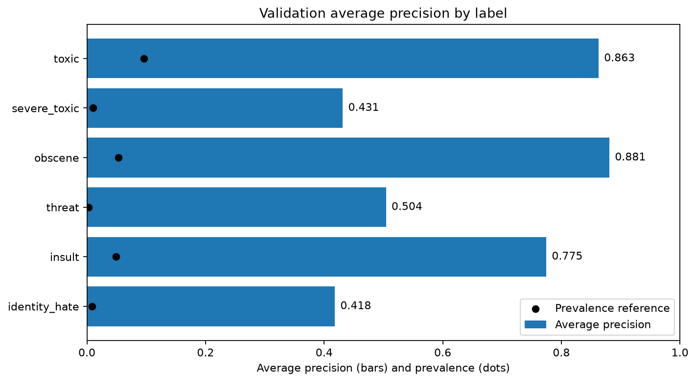

# Content Health Classifier

A multilabel text-classification project exploring how to detect toxic comments and evaluate the tradeoffs behind moderation decisions. The current baseline uses TF-IDF and six logistic-regression classifiers on Wikipedia talk-page comments.

**Status: baseline complete; threshold analysis planned.** Validation results are reported below. The held-out test partition has not been used for model evaluation or threshold selection. This is an analysis project, not a deployed moderation system.

## Data and findings

The project uses the labeled `train.csv` from the [Jigsaw Toxic Comment Classification Challenge](https://www.kaggle.com/competitions/jigsaw-toxic-comment-classification-challenge/data): **159,571 comments** with six overlapping binary labels: `toxic`, `severe_toxic`, `obscene`, `threat`, `insult`, and `identity_hate`.

Notebook 01 checks text completeness, duplicate IDs, binary labels, label frequencies, and co-occurrence patterns before saving reproducible split IDs.

- **89.8%** of comments have no positive labels.
- All **1,595** `severe_toxic` comments are also labeled `toxic`: **10.4%** of the 15,294 toxic comments.
- Exactly three labels occur more often than exactly two: **4,209 vs. 3,480 comments**. The `toxic` + `obscene` + `insult` combination accounts for **3,800 of the three-label comments (90.3%)**.

These are annotation patterns. The number of labels is not a validated severity scale, and co-occurrence alone does not establish why labels overlap.

## Baseline method

- Multilabel-stratified **70/15/15** splits with seed **42**: 111,699 training, 23,936 validation, and 23,936 test comments.
- Word-unigram TF-IDF with up to **30,000 features**, minimum document frequency of 2, sublinear term frequency, and L2 normalization. Vocabulary and IDF weights are fitted on training text only.
- One independent logistic-regression classifier per label, using balanced class weights, `C=1.0`, the `liblinear` solver, and a maximum of 200 iterations.
- Validation scores and targets aligned by comment ID. Per-label average precision (AP) is reported alongside positive support and prevalence.

AP measures ranking performance without choosing a threshold. Prevalence is the AP of a constant-score reference; it gives context for class imbalance.

## Validation results

| Label | Average precision | Positive comments | Prevalence |
|---|---:|---:|---:|
| toxic | 0.8629 | 2,294 | 9.58% |
| severe_toxic | 0.4315 | 240 | 1.00% |
| obscene | 0.8812 | 1,267 | 5.29% |
| threat | 0.5045 | 71 | 0.30% |
| insult | 0.7747 | 1,182 | 4.94% |
| identity_hate | 0.4182 | 211 | 0.88% |

**Macro AP: 0.6455**, the equally weighted mean of the six label scores.



All six scores exceed their prevalence references. Obscene and toxic have the highest measured AP, but differences between labels also reflect prevalence and task difficulty. Threat has only 71 validation positives, so its result needs particular caution. No uncertainty intervals have been estimated.

## Reproduce the analysis

Use **Python 3.12**, the version used for the verified run. From the repository root, create an environment:

```bash
python -m venv .venv
```

Activate it on macOS/Linux:

```bash
source .venv/bin/activate
```

Or in Windows PowerShell:

```powershell
.\.venv\Scripts\Activate.ps1
```

Install dependencies and open JupyterLab:

```bash
python -m pip install -r requirements.txt
python -m jupyter lab
```

Download the competition data from the linked Kaggle page, following its access requirements. Extract the labeled training CSV, including any nested ZIP, to **`data/raw/train.csv`**. This project creates its own held-out split from that labeled file; the competition's separate test file is not needed for this baseline.

Select the virtual environment's Python kernel and run these notebooks from top to bottom, in order:

1. [`01_exploration.ipynb`](notebooks/01_exploration.ipynb): data checks, EDA, and saved split IDs.
2. [`02_baseline_model.ipynb`](notebooks/02_baseline_model.ipynb): features, classifiers, validation evaluation, chart, and exports.

Notebook paths are relative to the `notebooks/` directory. Notebook 02 runs independently once notebook 01 has saved the split files. The requirements use minimum versions rather than a locked environment, so exact results can vary across dependency versions. The latest verified run used Python 3.12.14 and scikit-learn 1.9.1; the local manifest records the remaining versions and parameters.

## Outputs and verification

Public aggregate outputs are under `dashboard/`: the validation metrics CSV and AP chart. Running notebook 02 also creates these gitignored local artifacts:

- `data/processed/baseline_validation_scores.csv`: comment IDs and six validation scores, without raw text.
- `data/processed/baseline_manifest.json`: settings, versions, split-file hashes, partition sizes, and evaluation status.
- `checkpoints/baseline_v1_full_train.joblib`: the fitted vectorizer and six classifiers.

Restart the kernel and run notebook 02 top to bottom to reproduce the outputs. Its checks cover score shape, label order, target alignment, finite scores, valid AP values, and positive support. A reload check compares saved-model scores with in-memory scores on 50 validation comments.

Raw data, fitted models, and row-level exports are excluded from version control. The source dataset contains offensive text; this README and its chart contain aggregate results only.

## Limitations and next steps

Wikipedia comments are a limited proxy for content moderation and do not establish performance on TikTok or other platforms. Independent classifiers do not enforce relationships between labels. Class-weighted scores have not been checked for probability calibration, and AP alone does not establish a useful moderation threshold.

Next, compare thresholds using validation scores and illustrative false-positive/false-negative costs, report precision, recall, and error counts, and examine how cost assumptions change the recommendation. Evaluate the held-out test partition after settings and thresholds are fixed. A transformer comparison and dashboard remain future extensions, not completed results.
